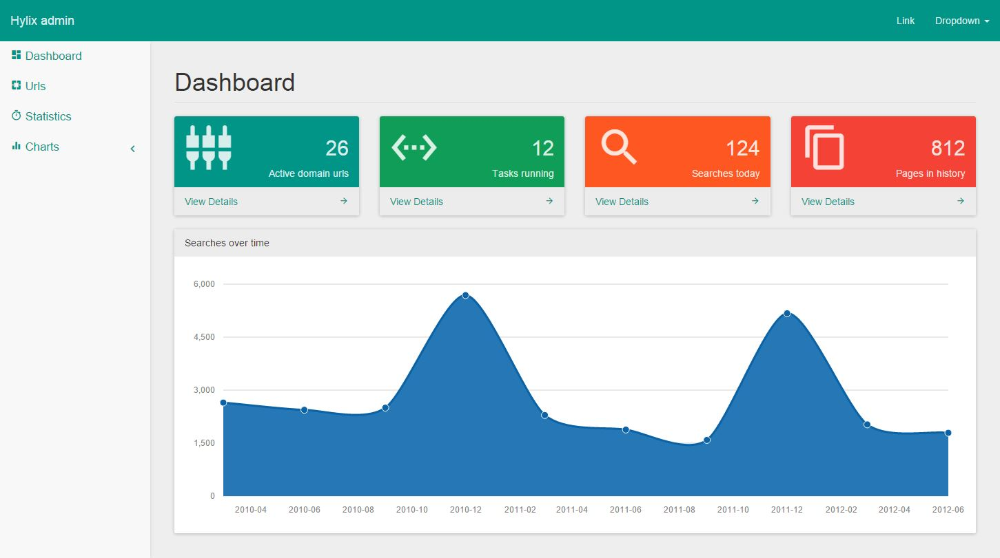

# Hylix-Adminpanel
A simple onepage adminpanel with a material flavor.

Inspired by [SB Admin 2](http://startbootstrap.com/template-overviews/sb-admin-2/) but completely written from the ground up to deliver a easy to configure panel.

## Demo
[Check it out!](http://admin.dirkjanwassink.nl/)

## How to
First install the bower packages by running `bower install` in your command prompt. Don't have bower? [Install it!](http://bower.io/)

Just simply create your own pages in the pages directory and add a link to them in the sidebar. The panel will automatically use ajax to load your page in the main content.

## Note
You need to run it through a server to be able to load the pages through ajax. I recommend `http-server` you can easily install it by running `npm install http-server -g` in your command prompt. Now simply run `http-server` in the root directory of the adminpanel.
